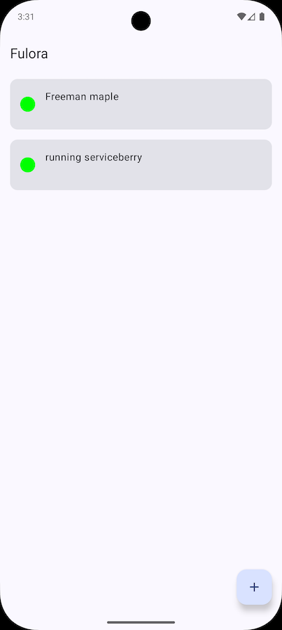
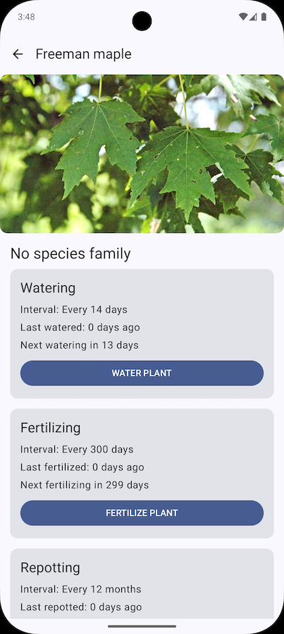

# Fulora - Plant Management App

A simple and intuitive Android application built to help plant lovers catalog and manage their personal plant collection.

## 📸 Screenshots

|            Home Screen            |         Create Plant Screen         |         Plant Details Screen         |
|:---------------------------------:|:-----------------------------------:|:------------------------------------:|
|  |  |  |

## 🌱 About The Project

Fulora is a modern Android application developed as a practical exercise to explore the latest trends in native Android development. The goal is to create a functional, well-architected, and easy-to-maintain app using a fully modern tech stack.

The app allows users to keep a digital inventory of their plants, making it easy to remember what they own and manage their collection.

## 🛠️ Tech Stack & Architecture

This project is built with a 100% Kotlin, modern tech stack, following Google's recommended practices for building robust and scalable apps.

*   **UI:** [Jetpack Compose](https://developer.android.com/jetpack/compose) for a declarative, modern UI toolkit.
*   **Architecture:** MVVM (Model-View-ViewModel) to ensure a clean separation of concerns.
*   **Language:** [Kotlin](https://kotlinlang.org/) First.
*   **Asynchronicity:** [Kotlin Coroutines](https://kotlinlang.org/docs/coroutines-overview.html) & [Flow](https://developer.android.com/kotlin/flow) for managing background threads and reactive data streams.
*   **Dependency Injection:** [Hilt](https://developer.android.com/training/dependency-injection/hilt-android) for robust dependency management.
*   **Navigation:** [Navigation Compose](https://developer.android.com/jetpack/compose/navigation) for handling all in-app navigation.
*   **Data Persistence:** Room for local data storage.

## ✨ Features

*   [x] View a list of all cataloged plants.
*   [x] Add a new plant to the collection.
*   [ ] Edit an existing plant's details. *(Planned)*
*   [ ] Delete a plant from the collection. *(Planned)*

## 🚀 Getting Started

To get a local copy up and running, follow these simple steps.

### Prerequisites

*   Android Studio Hedgehog (2023.1.1) or newer.
*   Gradle 8.0 or newer.

### Installation

1.  **Clone the repository:**
```bash
git clone https://github.com/danielvilha/kotlin-fulora.git
```
2.  **Open in Android Studio:**
   *   Open Android Studio.
   *   Select `File > Open` and choose the cloned project directory.
3.  **Sync Gradle:**
    *   Let Android Studio sync the project and download all the required dependencies.
4.  **Run the app:**
    *   Select an emulator or connect a physical device.
    *   Click the 'Run' button (▶).

## 📄 License

Copyright 2025 Daniel Vilha

Permission is hereby granted, free of charge, to any person obtaining a copy of this software and associated documentation files (the “Software”), to deal in the Software without restriction, including without limitation the rights to use, copy, modify, merge, publish, distribute, sublicense, and/or sell copies of the Software, and to permit persons to whom the Software is furnished to do so, subject to the following conditions:

The above copyright notice and this permission notice shall be included in all copies or substantial portions of the Software.

THE SOFTWARE IS PROVIDED “AS IS”, WITHOUT WARRANTY OF ANY KIND, EXPRESS OR IMPLIED, INCLUDING BUT NOT LIMITED TO THE WARRANTIES OF MERCHANTABILITY, FITNESS FOR A PARTICULAR PURPOSE AND NONINFRINGEMENT. IN NO EVENT SHALL THE AUTHORS OR COPYRIGHT HOLDERS BE LIABLE FOR ANY CLAIM, DAMAGES OR OTHER LIABILITY, WHETHER IN AN ACTION OF CONTRACT, TORT OR OTHERWISE, ARISING FROM, OUT OF OR IN CONNECTION WITH THE SOFTWARE OR THE USE OR OTHER DEALINGS IN THE SOFTWARE.